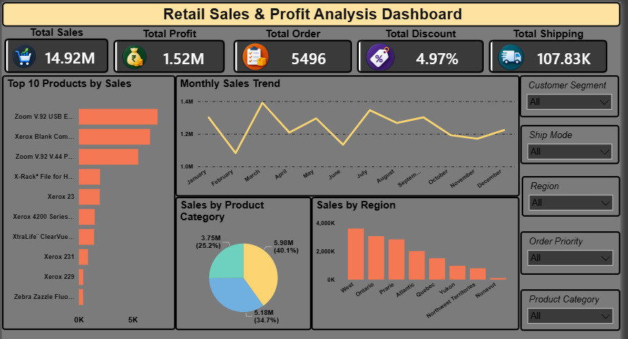

# 📊 Retail Sales & Profit Analysis

## 📌 Project Overview

This project focuses on analyzing retail sales data to understand sales performance, profit, customer segments, products, and regional performance.

The data was cleaned and analyzed using **Excel**, and a **Power BI dashboard** was created to present the key business insights in an easy-to-understand way.

The main purpose of this project was to practice real-world **Data Analyst skills**, including data cleaning, data analysis, business insight generation, and dashboard creation.

## 🎯 Project Objectives

* Clean and prepare the retail sales dataset
* Analyze overall sales and profit performance
* Identify high-performing regions and product categories
* Find the top products by sales
* Analyze profit contribution by customer segment
* Understand monthly sales trends
* Create an interactive Power BI dashboard
* Generate useful business insights from the data

## 🛠️ Tools Used

* **Microsoft Excel** – Data cleaning and analysis
* **Power BI** – Dashboard and visualization
* **GitHub** – Project documentation and portfolio

## 📂 Dataset

The dataset contains information related to orders, customers, products, sales, discounts, shipping, and profit.

Some important columns include:

* Order ID
* Order Date
* Order Quantity
* Sales
* Discount
* Profit
* Shipping Cost
* Customer Name
* Region
* Customer Segment
* Product Category
* Product Sub-Category
* Product Name
* Ship Mode

## 🧹 Data Cleaning

## 📊 Dashboard

The following cleaning activities were performed:

* Removed duplicate records
* Checked missing values
* Formatted date columns
* Checked numeric columns
* Standardized data where required

The cleaned dataset contains **8,399 records**.

## 📊 Key KPIs

| KPI                 |    Value |
| ------------------- | -------: |
| Total Sales         |  $14.92M |
| Total Profit        |   $1.52M |
| Total Orders        |    5,496 |
| Average Discount    |    4.97% |
| Total Shipping Cost | $107.83K |

## 🔍 Business Insights

### 🌎 Sales by Region

**West** generated the highest sales among the regions, followed by Ontario and Prarie.

### 📦 Profit by Product Category

**Technology** was the most profitable product category, generating approximately **$886K** in profit.

### 👥 Profit by Customer Segment

**Corporate** customers contributed the highest profit at approximately **$600K**.

### 🏆 Top Products by Sales

The highest-revenue products included:

1. Global Troy Executive Leather Low-Back Tilter
2. Polycom ViewStation ISDN Videoconferencing Unit
3. Canon PC940 Copier
4. Riverside Palais Royal Lawyers Bookcase
5. Hewlett Packard LaserJet 3310 Copier

## 📈 Power BI Dashboard

The dashboard provides a quick view of:

* Total Sales
* Total Profit
* Sales by Region
* Sales by Product Category
* Top Products by Sales
* Monthly Sales Trend
* Profit by Customer Segment

## 💡 Key Takeaways

* West region had the highest sales performance.
* Technology was the strongest category in terms of profit.
* Corporate customers generated the highest profit.
* A small group of products contributed significantly to total revenue.
* The dashboard makes it easier to compare sales and profit performance across different business areas.

## 📁 Project Files

* `Project Retail Sales & Profit Analysis clean.xlsx` – Cleaned dataset and analysis
* `dashboard.pbix` – Power BI dashboard
* `Project 1– Retail Sales & Profit Analysis Docx.docx` – Project documentation

## 🎓 Skills Demonstrated

* Data Cleaning
* Data Analysis
* Excel
* Power BI
* Data Visualization
* KPI Analysis
* Business Analysis
* Business Insight Generation

## 👨‍💻 Project Type

**Data Analyst Internship Project**

This project helped me understand how raw business data can be cleaned, analyzed, visualized, and converted into useful business insights.
